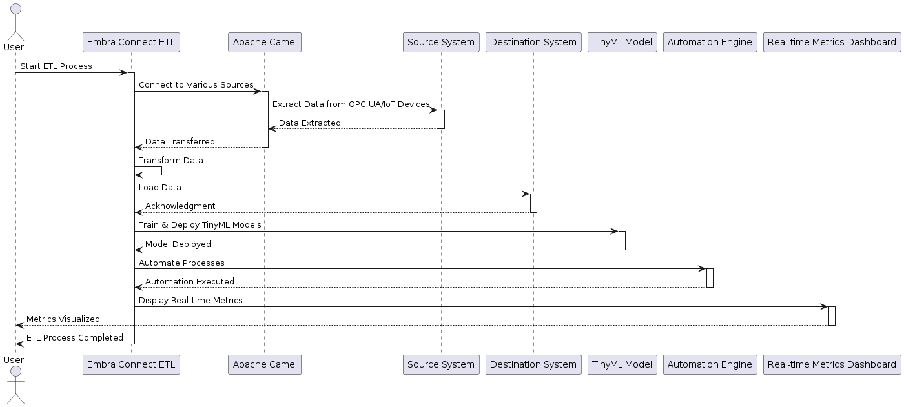

## Embra Connect

### Landing Page

Welcome to **Embra Connect**!

Think of Embra Connect like a universal power strip for IoT and edge device data pipelines. Just like a power strip lets you plug in and manage multiple devices effortlessly, Embra Connect provides a unified way to connect, process, and orchestrate data from different edge devices—whether you're a hobbyist tinkering in your garage or a professional deploying at scale. You can set it up yourself for full control or use the managed version for a plug-and-play experience.

### Key Features:

-   **Streamlined ETL Processes**: Simplify your data workflows with a user-friendly interface and powerful capabilities.
-   **Flexibility**: Run locally or in the cloud, adapting to whatever setup you need.
-   **Open-Source**: Join a growing community of contributors and benefit from continuous improvements and shared knowledge.

Get started with Embra Connect today and transform the way you handle data integration!

----------

Feel free to explore our documentation, contribute to the project, and reach out with any questions or feedback. We're excited to have you on board!

### Getting Started

Check out our documentation to learn how to install and configure Embra Connect. Join our community for support and discussions.

Happy data integrating!
